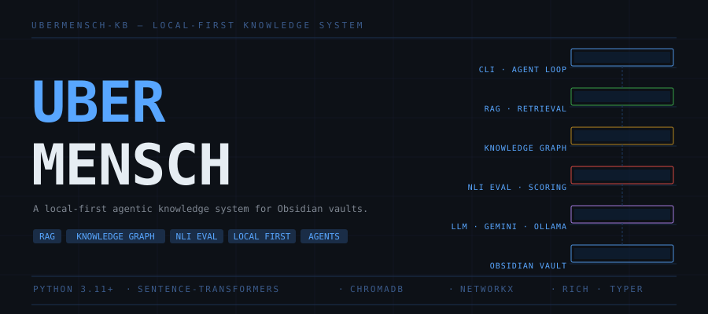
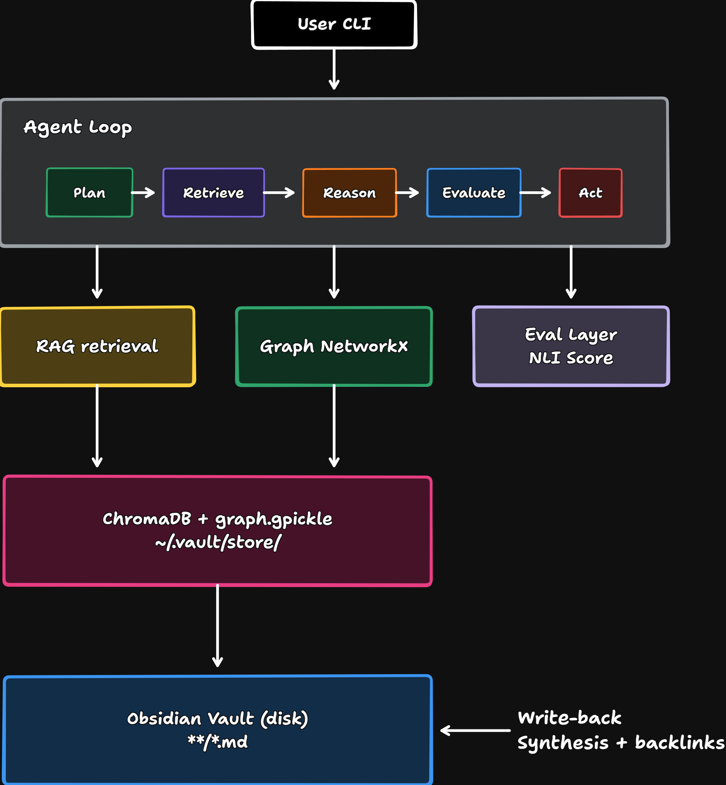

# Ubermensch

A local-first, agentic knowledge system that turns your Obsidian vault into queryable, self-organizing knowledge base

## What it does?

```bash
vault agent run
    ╭─ Vault Agent ───────────────────────────────────────── ╮
    │  Vault: ai-research  ·  84 chunks  ·  31 graph edges   │
    │  Type /help for commands  ·  /exit to quit             │
    ╰────────────────────────────────────────────────────────╯

    > What are my key ideas on transformer architecture?

    ───────────────────── Sources retrieved ─────────────────
    1.  Transformer Architecture    relevance 0.821
    2.  Attention Mechanism         relevance 0.743
    3.  Positional Encoding         relevance 0.698

    ──────────────────────────── Answer ─────────────────────
    Based on your notes, the transformer architecture uses
    an encoder-decoder structure [Transformer Architecture]
    where self-attention computes relationships between all
    token positions simultaneously [Attention Mechanism]...

    Faithfulness: 84.2%  High confidence  ·  via NLI scorer

    > /graph map tokenizer

    ──────────────── Idea map: tokenizer ────────────────────
    Depth    Note                  Connection     Weight
    seed     Tokenizer types       —              —
    depth 1  MorphLing             wikilink+tag   1.30
    depth 1  Tokens                tag+semantic   0.72
    depth 2  LLM parameters        semantic       0.68
    depth 2  BPE and WordPiece     semantic       0.66
```

## Features

| Feature                  | Description                                                                     |
| ------------------------ | ------------------------------------------------------------------------------- |
| RAG over your vault      | Semantic search across all your obsidian notes, grounded answers with citations |
| Knowledge graph          | Built from wikilinks, shared tags, and semantic similarity                      |
| Backlink suggestions     | Discovers note connections you haven't made yet                                 |
| Idea mapping             | BFS exploration of any topic through your vault graph                           |
| Multi-step planner       | Decomposes complex questions into focused sub-questions                         |
| Cross-note synthesis     | Generates summaries and files them back into your vault                         |
| NLI faithfulness scoring | Hallucination detection via cross-encoder on every answer                       |
| Interactive agent loop   | REPL-style session — all commands available, stays open                         |
| Local-first              | Embeddings on-device, no vault content sent externally                          |
| Dual LLM backend         | Gemini Flash (free API) or Ollama (fully offline)                               |

## Quick Start

```bash
# Install
pip install ubermensch-kb

# Set your free Gemini API key (https://aistudio.google.com/app/apikey)
export GEMINI_API_KEY=your_key_here

# Index your vault
vault init --path ~/Documents/MyObsidianVault

# Start asking
vault ask "What are my notes on transformers?"

# Or launch the interactive loop
vault agent run
```

---

## Installation

**Base Install**

```bash
pip install ubermensch-kb
```

**Requirements:** Python 3.11+

---

## Commands

**Core**

```bash
vault init --path <vault_dir>        # parse → chunk → embed → store → graph
vault init --force                   # re-index everything (clears hash cache)
vault ask "your question"            # RAG query with note citations
vault ask "..." --eval               # + per-claim NLI faithfulness breakdown
vault ask "..." --llm ollama         # use local Ollama instead of Gemini
vault status                         # notes, chunks, graph coverage, PageRank hubs
vault doctor                         # full system health check
vault config                         # view saved config
vault config --set-key <key>         # save Gemini API key
vault publish --dry-run              # verify package before publishing to PyPI
```

**Graph**

```bash
vault graph build                    # build knowledge graph from vault
vault graph build --no-semantic      # wikilinks + tags only (faster)
vault graph map "tokenizer"          # BFS idea cluster around a topic
vault graph map "transformer" --depth 3
vault graph suggest                  # show unlinked semantically similar notes
vault graph suggest --confirm --write  # interactively write backlinks to vault
```

**Agent (interactive loop)**

```bash
vault agent run                      # launch with Gemini
vault agent run --llm ollama         # launch with local Ollama
vault agent run --llm ollama --model mistral
vault --verbose agent run            # show all internal process logs
```

**Inside the agent loop:**

```bash
> Any question              → RAG query with re-retrieval loop
> /plan <question>          → multi-step planner for complex questions
> /synthesize <topic>       → generate + save cross-note synthesis to vault
> /graph map <topic>        → BFS idea cluster
> /graph suggest            → backlink suggestions
> /graph build              → rebuild knowledge graph
> /llm gemini               → switch to Gemini backend
> /llm ollama [model]       → switch to local Ollama
> /llm status               → show current backend + model
> /verbose on|off           → show or hide internal process logs
> /eval on|off              → toggle faithfulness scoring
> /history                  → session question history
> /clear                    → clear screen
> /help                     → all commands
> /exit                     → quit
```

---

## Commands

**Core**

```bash
vault init --path <vault_dir>        # parse → chunk → embed → store → graph
vault init --force                   # re-index everything (clears hash cache)
vault ask "your question"            # RAG query with note citations
vault ask "..." --eval               # + per-claim NLI faithfulness breakdown
vault ask "..." --llm ollama         # use local Ollama instead of Gemini
vault status                         # notes, chunks, graph coverage, PageRank hubs
vault doctor                         # full system health check
vault config                         # view saved config
vault config --set-key <key>         # save Gemini API key
vault publish --dry-run              # verify package before publishing to PyPI
```

**Graph**

```bash
vault graph build                    # build knowledge graph from vault
vault graph build --no-semantic      # wikilinks + tags only (faster)
vault graph map "tokenizer"          # BFS idea cluster around a topic
vault graph map "transformer" --depth 3
vault graph suggest                  # show unlinked semantically similar notes
vault graph suggest --confirm --write  # interactively write backlinks to vault
```

**Agent (interactive loop)**

```bash
vault agent run                      # launch with Gemini
vault agent run --llm ollama         # launch with local Ollama
vault agent run --llm ollama --model mistral
vault --verbose agent run            # show all internal process logs
```

**Inside the agent loop:**

```bash
> Any question              → RAG query with re-retrieval loop
> /plan <question>          → multi-step planner for complex questions
> /synthesize <topic>       → generate + save cross-note synthesis to vault
> /graph map <topic>        → BFS idea cluster
> /graph suggest            → backlink suggestions
> /graph build              → rebuild knowledge graph
> /llm gemini               → switch to Gemini backend
> /llm ollama [model]       → switch to local Ollama
> /llm status               → show current backend + model
> /verbose on|off           → show or hide internal process logs
> /eval on|off              → toggle faithfulness scoring
> /history                  → session question history
> /clear                    → clear screen
> /help                     → all commands
> /exit                     → quit
```

---

## Architecture


